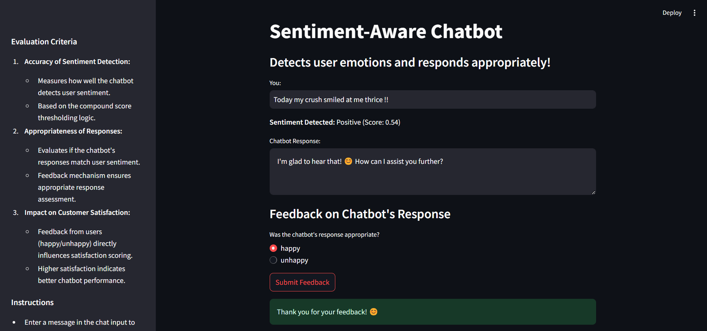
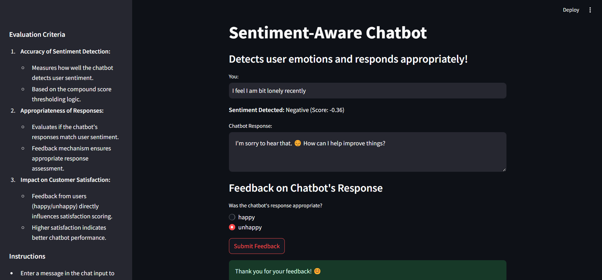

### Integrated sentiment analysis into the chatbot to detect and respond appropriately to customer emotions during interactions. 

### This chatbot that can recognize and address positive, negative, or neutral sentiments in user messages. 

#### Evaluation Criteria: Accuracy of sentiment detection, appropriateness of responses to different sentiments, impact on customer satisfaction.

